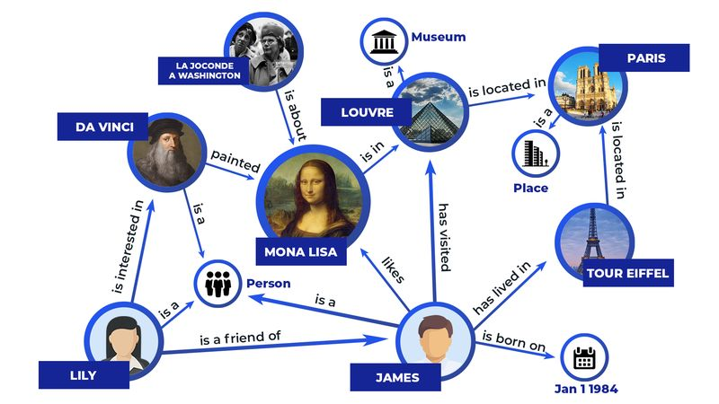

# SEO Phase 4 Results — Performance and Core Web Vitals
**Site:** timursalakhetdinov.com  
**Date:** 2026-05-20  
**Branch:** `claude/seo-portfolio-optimization-PnypN`  
**Commits:** `e573c22` (image files), `53fbf15` (HTML changes)

---

## 4.1 Avatar Conversion

| Version | File | Dimensions | Size | Notes |
|---|---|---|---|---|
| Original (backup) | `images/avatar-original.jpg` | 3644x3179 px | 962.6 KB | Preserved, not referenced in HTML |
| WebP (primary) | `images/avatar.webp` | 1200x1179 px | 76.5 KB | Served to all modern browsers |
| JPEG (fallback) | `images/avatar.jpg` | 1200x1179 px | 128.4 KB | Served to Safari pre-14 and IE |

**Savings vs original:** 886 KB (WebP path) / 834 KB (JPEG fallback path)

The avatar renders identically on screen. The `.author-photo` CSS class (`width: 100%; height: 100%; object-fit: cover`) is unchanged and applied to the inner ``.

---

## 4.2 LCP Preload

Added to `<head>` of both pages, before the favicon and font links:

```html
<link rel="preload" as="image" href="/images/avatar.webp" type="image/webp" fetchpriority="high">
```

This causes the browser to initiate the avatar fetch during HTML parsing, before the layout engine reaches the `<picture>` element in the body. On slow mobile connections, this typically saves 200-800 ms of LCP time.

---

## 4.3 Thumbnail Conversions

All thumbnails resized to max 800 px wide, quality 80. Original files re-encoded at same quality for JPEG/PNG fallbacks.

| File | Original | Dimensions | WebP | JPEG/PNG fallback | WebP saving vs original |
|---|---|---|---|---|---|
| `thumbs/06.jpg` | 628.3 KB | 800x450 | 39.1 KB | 57.1 KB (JPEG) | 589 KB |
| `thumbs/05.png` | 454.4 KB | 800x533 | 16.3 KB | 30.7 KB (`05.jpg`, new JPEG) | 438 KB |
| `thumbs/03.jpg` | 348.8 KB | 800x400 | 79.3 KB | 111.3 KB (JPEG) | 270 KB |
| `thumbs/02.jpeg` | 210.4 KB | 800x417 | 37.7 KB | 60.8 KB (JPEG) | 173 KB |
| `thumbs/01.jpg` | 182.5 KB | 800x496 | 18.2 KB | 31.7 KB (JPEG) | 164 KB |

Note on `05.png`: the original PNG format was replaced with `05.jpg` as the JPEG fallback (30.7 KB) because the thumbnail content is photographic and does not require lossless encoding. The `05.png` re-encoded file remains in the repo but the HTML fallback now points to `05.jpg`.

Note on `03.webp`: the original file opened in RGBA mode (unusual for a JPEG). Re-encoded as RGB for WebP to avoid inflated file size; result is 79.3 KB vs the 144.7 KB that the RGBA WebP produced.

---

## 4.4 Total Bandwidth Savings (Cold Cache, WebP Path)

| Asset | Before | After (WebP) | Saved |
|---|---|---|---|
| `avatar.jpg` | 962.6 KB | 76.5 KB | 886.1 KB |
| `thumbs/06.jpg` | 628.3 KB | 39.1 KB | 589.2 KB |
| `thumbs/05.png` | 454.4 KB | 16.3 KB | 438.1 KB |
| `thumbs/03.jpg` | 348.8 KB | 79.3 KB | 269.5 KB |
| `thumbs/02.jpeg` | 210.4 KB | 37.7 KB | 172.7 KB |
| `thumbs/01.jpg` | 182.5 KB | 18.2 KB | 164.3 KB |
| **Total** | **2786.9 KB** | **267.1 KB** | **2519.8 KB** |

**Total image weight reduced by 2.5 MB (90%) on the WebP path.**  
On the JPEG fallback path (older browsers): savings of ~2.3 MB.

---

## 4.5 `<picture>` Elements and `` Attributes

### Avatar (both pages)

```html
<picture>
  <source srcset="images/avatar.webp" type="image/webp">
  
</picture>
```

- `loading="lazy"`: NOT present (avatar is LCP, must load eagerly)
- `fetchpriority="high"`: present
- `width` / `height`: 1200 / 1179 (matches intrinsic size of converted file)

### All 5 project thumbnails (both pages)

All wrapped in `<picture>` with WebP source and original-format fallback. Example:

```html
<picture>
  <source srcset="images/thumbs/06.webp" type="image/webp">
  
</picture>
```

- `loading="lazy"`: present on all five
- `width` / `height`: set to actual intrinsic dimensions of each converted file
- CLS prevention: container uses `aspect-ratio: 4/3` in CSS + intrinsic dimensions on `` for double coverage

---

## 4.6 Script Audit

| Script | Location | Type | `defer` | `async` | Notes |
|---|---|---|---|---|---|
| JSON-LD structured data | `<head>` | `type="application/ld+json"` | n/a | n/a | Not executable JS |
| IntersectionObserver (fade-in) | Bottom of `<body>` | Inline | n/a | n/a | Already at end of body, no deferral needed |
| Medium RSS fetch | Bottom of `<body>` | Inline async IIFE | n/a | n/a | Already at end of body, non-blocking |

No external script files (`assets/js/`) are loaded by either page. The `assets/js/` directory exists in the repo but is not referenced in any `<script src>` tag. No changes made.

---

## 4.7 Font Loading

Both pages already have the optimal setup:

```html
<link rel="preconnect" href="https://fonts.googleapis.com">
<link rel="preconnect" href="https://fonts.gstatic.com" crossorigin>
<link href="https://fonts.googleapis.com/css2?...&display=swap" rel="stylesheet">
```

- `preconnect` for `fonts.googleapis.com`: present
- `preconnect` for `fonts.gstatic.com` with `crossorigin`: present (crossorigin is required for this specific origin and was already correct)
- `display=swap`: present in URL

No changes made.

---

## 4.8 CSS Check

`assets/css/main.css` is not referenced in either HTML file. Both pages use a 454-line inline `<style>` block. No wasted HTTP request to remove.

---

## 4.9 Raster Image Dimensions Checklist

| Image | `width` | `height` | `loading` | `fetchpriority` | Status |
|---|---|---|---|---|---|
| `images/avatar.jpg` | 1200 | 1179 | eager (default) | high | OK |
| `images/thumbs/06.jpg` | 800 | 450 | lazy | none | OK |
| `images/thumbs/05.jpg` | 800 | 533 | lazy | none | OK |
| `images/thumbs/03.jpg` | 800 | 400 | lazy | none | OK |
| `images/thumbs/01.jpg` | 800 | 496 | lazy | none | OK |
| `images/thumbs/02.jpeg` | 800 | 417 | lazy | none | OK |

All raster `` elements have explicit `width` and `height`. The `bg.jpg` file exists on disk but is not referenced as an `` tag anywhere. The agent topology is an inline SVG with `viewBox="0 0 480 360"` — no raster dimensions needed.

---

## 4.10 CSS Fix for `<picture>` in Containers

Two CSS rules added to both pages to prevent `<picture>` from introducing inline spacing:

```css
.proj-thumb picture { display: block; width: 100%; height: 100%; }
.author-photo-wrap picture { display: block; width: 100%; height: 100%; }
```

Without these, `<picture>` as an inline element inside `overflow: hidden` containers could produce a 4 px baseline gap below the ``.

---

## Manual Verification Checklist

After deploy:

- [ ] Open site and confirm avatar renders at the same size and with the same CSS filter (desaturated, slight contrast boost)
- [ ] Open DevTools Network tab, filter by Images, confirm `avatar.webp` loads (not `avatar.jpg`) in Chrome
- [ ] Confirm `avatar-original.jpg` is NOT loaded by the browser (it is not referenced in HTML)
- [ ] Run PageSpeed Insights: target LCP under 2.5 s, CLS under 0.1
- [ ] Run Lighthouse mobile profile: check for remaining image-size warnings
- [ ] Confirm `loading="lazy"` is absent on the avatar ``
- [ ] Confirm `loading="lazy"` is present on all 5 project thumbnails

---

## What Comes Next (Phase 5)

- Add "What I work on" paragraph above the Projects section with natural keyword coverage
- Fix Writing section empty-state when Medium RSS returns no posts
- Ensure contact section email is indexable as plain text (already confirmed in Phase 1 — may be left as-is)
